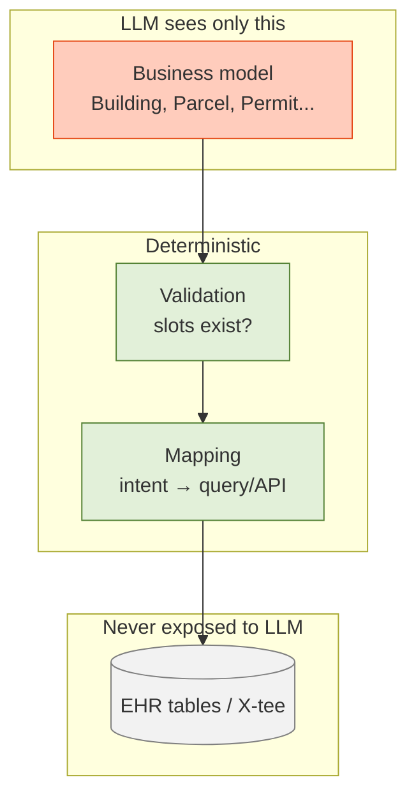

# Layers

```mermaid
flowchart TB
    subgraph Model["LLM sees only this"]
        direction TB
        BM[Business model<br/>Building, Parcel, Permit...]:::llm
    end
    subgraph Map["Deterministic"]
        direction TB
        MP[Mapping<br/>intent → query/API]:::det
        VL[Validation<br/>slots exist?]:::det
    end
    subgraph Phys["Never exposed to LLM"]
        direction TB
        EHR[(EHR tables / X-tee)]:::data
    end
    BM --> VL --> MP --> EHR

    classDef llm fill:#FFCCBC,stroke:#E64A19;
    classDef det fill:#e2f0d9,stroke:#548235;
    classDef data fill:#f2f2f2,stroke:#7f7f7f;
```

- EHR schema changes → update mapping only. No retraining.
- Personal data stays out of the model.
