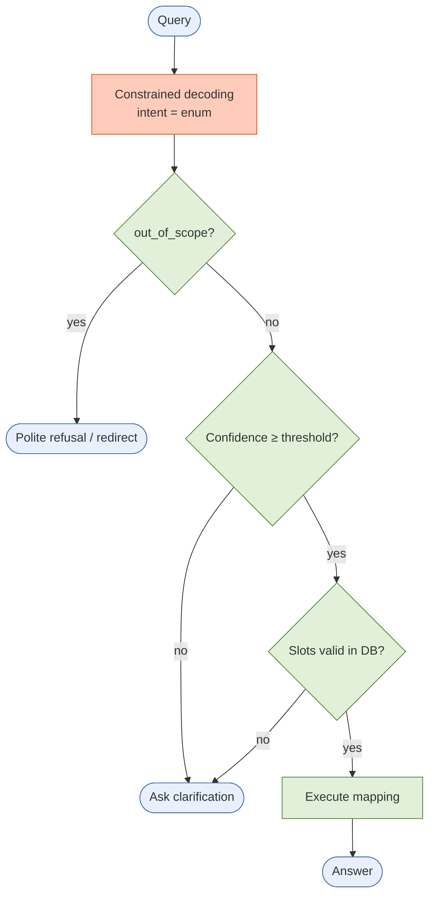

# Runtime decisions

```mermaid
flowchart TD
    Q([Query]):::user --> D[Constrained decoding<br/>intent = enum]:::llm
    D --> O{out_of_scope?}:::det
    O -->|yes| R1([Polite refusal / redirect]):::user
    O -->|no| CF{Confidence ≥ threshold?}:::det
    CF -->|no| R2([Ask clarification]):::user
    CF -->|yes| SV{Slots valid in DB?}:::det
    SV -->|no| R2
    SV -->|yes| EX[Execute mapping]:::det
    EX --> R3([Answer]):::user

    classDef user fill:#e8f0fe,stroke:#4a6fa5;
    classDef llm fill:#FFCCBC,stroke:#E64A19;
    classDef det fill:#e2f0d9,stroke:#548235;
```

- Never guess: low confidence → clarify.
- Confidence from token logprobs and/or self-consistency.
