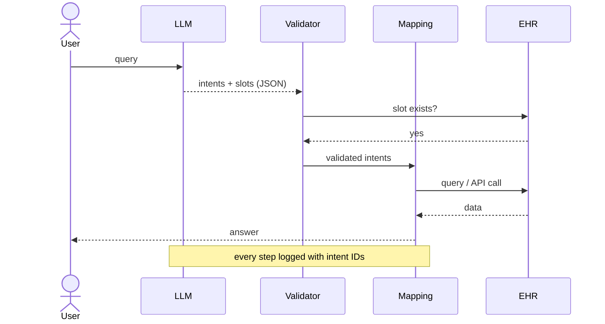

# Request lifecycle

```mermaid
sequenceDiagram
    actor U as User
    participant L as LLM
    participant V as Validator
    participant M as Mapping
    participant E as EHR

    U->>L: query
    L-->>V: intents + slots (JSON)
    V->>E: slot exists?
    E-->>V: yes
    V->>M: validated intents
    M->>E: query / API call
    E-->>M: data
    M-->>U: answer
    Note over L,M: every step logged with intent IDs
```
