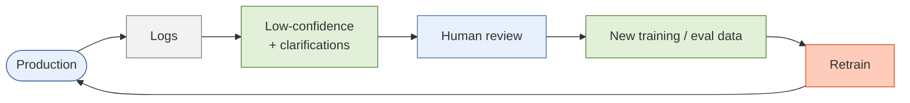

# Feedback loop

```mermaid
flowchart LR
    P([Production]):::user --> LG[Logs]:::data
    LG --> LC[Low-confidence<br/>+ clarifications]:::det
    LC --> RV[Human review]:::user
    RV --> TD[New training / eval data]:::det
    TD --> RT[Retrain]:::llm
    RT --> P

    classDef user fill:#e8f0fe,stroke:#4a6fa5;
    classDef llm fill:#FFCCBC,stroke:#E64A19;
    classDef det fill:#e2f0d9,stroke:#548235;
    classDef data fill:#f2f2f2,stroke:#7f7f7f;
```

- Real queries are the only path to "as exact as possible".
